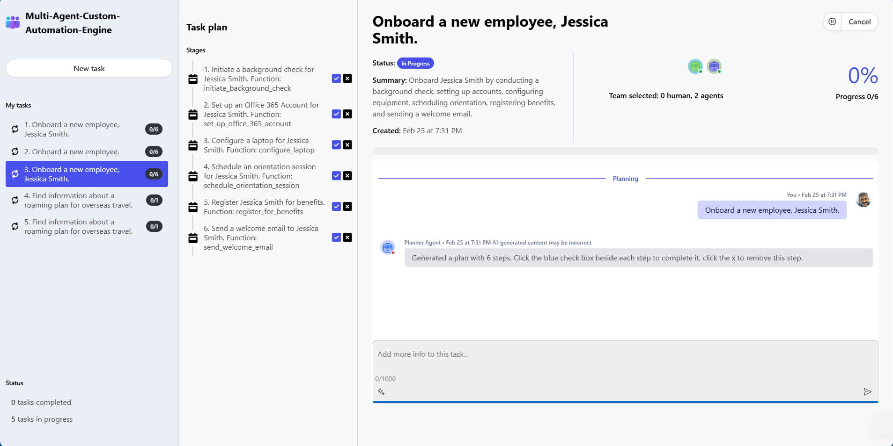
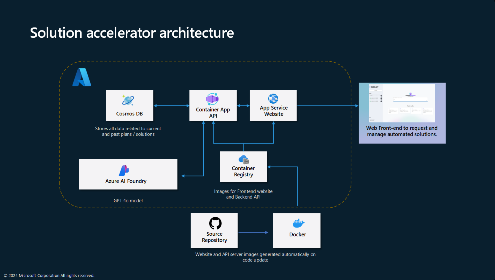

# Multi-Agent: Custom Automation Engine – Solution Accelerator

MENU: [**USER STORY**](#user-story) \| [**QUICK DEPLOY**](#quick-deploy)  \| [**SUPPORTING DOCUMENTATION**](#supporting-documentation) \|

<h2>
<br/>
User story
</h2>

### Overview

Problem:
Agentic AI systems are set to transform the way businesses operate, however it can be fairly complex to build an initial MVP to demonstrate this value. 

Solution:
The Multi-Agent -Custom Automation Engine Solution Accelerator provides a ready to go application to use as the base of the MVP, or as a reference, allowing you to hit the ground running.

### Technology Note
This accelerator uses the AutoGen framework from Microsoft Research.  This is an open source project that is maintained by [Microsoft Research’s AI Frontiers Lab](https://www.microsoft.com/research/lab/ai-frontiers/). Please see this [blog post](https://devblogs.microsoft.com/autogen/microsofts-agentic-frameworks-autogen-and-semantic-kernel/) for the latest information on using the AutoGen framework in production solutions.

### Use cases / scenarios
The multi-agent approach allows users to utilize multiple AI agents simultaneously for repeatable tasks, ensuring consistency and efficiency. 
The agents collaborate with a manager on various assignments for onboarding a new employee , such as HR and tech support AI working together to set up software accounts, configure hardware, schedule onboarding meetings, register employees for benefits, and send welcome emails. Additionally, these agents can handle tasks like procurement and drafting press releases.

### Business value
Multi-agent systems represent the next wave of Generative AI use cases, offering entirely new opportunities to drive efficiencies in your business. The Multi-Agent -Custom Automation Engine Solution Accelerator demonstrates several key benefits:

- **Allows people to focus on what matters:** by doing the heavy lifting involved with coordinating activities across an organization, peoples’ time is freed up to focus on their specializations.
- **Enabling GenAI to scale:** by not needing to build one application after another, organizations are able to reduce the friction of adopting GenAI across their entire organization. One capability can unlock almost unlimited use cases.
- **Applicable to most industries:** these are common challenges that most organizations face, across most industries.

Whilst still an emerging area, investing in agentic use cases, digitatization and developing tools will be key to ensuring you are able to leverage these new technologies and seize the GenAI moment.

### Technical key features

This application is an AI-driven orchestration system that manages a group of AI agents to accomplish tasks based on user input. It uses a FastAPI backend to handle HTTP requests, processes them through various specialized agents, and stores stateful information using Azure Cosmos DB. The system is designed to:

- Receive input tasks from users.
- Generate a detailed plan to accomplish the task using a Planner agent.
- Execute the plan by delegating steps to specialized agents (e.g., HR, Procurement, Marketing).
- Incorporate human feedback into the workflow.
- Maintain state across sessions with persistent storage.

This system is intended for developing and deploying custom AI solutions for specific customers. This code has not been tested as an end-to-end, reliable production application- it is a foundation to help accelerate building out multi-agent systems. You are encouraged to add your own data and functions to the agents, and then you must apply your own performance and safety evaluation testing frameworks to this system before deploying it.

\



### Products used/licenses required

-   Azure Container Application

-   Azure OpenAI

-   Azure Cosmos DB

-   The user deploying the template must have permission to create
    resources and resource groups.

### Solution accelerator architecture



### **How to install/deploy**

This guide provides step-by-step instructions for deploying your application using Azure Container Registry (ACR) and Azure Container Apps.

There are several ways to deploy the solution.  You can deploy to run in Azure in one click, or manually, or you can deploy locally.

## Quick Deploy

<h2></h2>

[](https://portal.azure.com/#create/Microsoft.Template/uri/https%3A%2F%2Fraw.githubusercontent.com%2Fmicrosoft%2FMulti-Agent-Custom-Automation-Engine-Solution-Accelerator%2Frefs%2Fheads%2Fmain%2Fdeploy%2Fmacae-continer-oc.json)

When Deployment is complete, follow steps in [Set Up Authentication in Azure App Service](./documentation/azure_app_service_auth_setup.md) to add app authentication to your web app running on Azure App Service

## Local Deployment
To run the solution site and API backend only locally for development and debugging purposes, See the [local deployment guide](./documentation/LocalDeployment.md).

## Manual Azure Deployment
Manual Deployment differs from the ‘Quick Deploy’ option in that it will install an Azure Container Registry (ACR) service, and relies on the installer to build and push the necessary containers to this ACR.  This allows you to build and push your own code changes and provides a sample solution you can customize based on your requirements.

### Prerequisites

- Current Azure CLI installed
  You can update to the latest version using ```az upgrade```
- Azure account with appropriate permissions
- Docker installed

### Deploy the Azure Services
All of the necessary Azure services can be deployed using the /deploy/macae.bicep script.  This script will require the following parameters:

```
az login
az account set --subscription <SUBSCRIPTION_ID>
az group create --name <RG_NAME> --location <RG_LOCATION>
```
To deploy the script you can use the Azure CLI.
```
az deployment group create \
  --resource-group <RG_NAME> \
  --template-file <BICEP_FILE> \
  --name <DEPLOYMENT_NAME>
```

Note: if you are using windows with PowerShell, the continuation character (currently ‘\’) should change to the tick mark (‘`’).

The template will require you fill in locations for Cosmos and OpenAI services.  This is to avoid the possibility of regional quota errors for either of these resources.

### Create the Containers
#### Get admin credentials from ACR

Retrieve the admin credentials for your Azure Container Registry (ACR):

```sh
az acr credential show \
--name <e.g. macaeacr2t62qyozi76bs> \
--resource-group <rg-name>
```

#### Login to ACR

Login to your Azure Container Registry:

```sh
az acr login --name <e.g. macaeacr2t62qyozi76bs>
```

#### Build and push the image

Build the frontend and backend Docker images and push them  to your Azure Container Registry. Run the following from the src/backend and the src/frontend directory contexts:

```sh
az acr build \
--registry <e.g. macaeacr2t62qyozi76bs> \
--resource-group <rg-name> \
--image <e.g. backendmacae:latest> .
```

### Add images to the Container APP and Web App services

To add your newly created backend image: 
- Navigate to the Container App Service in the Azure portal
- Click on Application/Containers in the left pane
- Click on the "Edit and deploy" button in the upper left of the containers pane
- In the "Create and deploy new revision" page, click on your container image 'backend'.  This will give you the option of reconfiguring the container image, and also has an Environment variables tab
- Change the properties page to 
  - point to your Azure Container registry with a private image type and your image name (e.g. backendmacae:latest)
  - under "Authentication type" select "Managed Identity" and choose the 'mace-containerapp-pull'... identity setup in the bicep template
- In the environment variables section add the following (each with a 'Manual entry' source):

        name: 'COSMOSDB_ENDPOINT'
        value: \<Cosmos endpoint>

        name: 'COSMOSDB_DATABASE'
        value: 'autogen'
	    Note: To change the default, you will need to create the database in Cosmos
			  
        name: 'COSMOSDB_CONTAINER'
        value: 'memory'

        name: 'AZURE_OPENAI_ENDPOINT'
        value: <Azure OpenAI endpoint>

        name: 'AZURE_OPENAI_DEPLOYMENT_NAME'
        value: 'gpt-4o'

        name: 'AZURE_OPENAI_API_VERSION'
        value: '2024-08-01-preview'
		Note: Version should be updated based on latest available

        name: 'FRONTEND_SITE_NAME'
        value: 'https://<website Name>.azurewebsites.net'

- Click 'Save' and deploy your new revision

To add the new container to your website run the following:

```
az webapp config container set --resource-group macae_full_deploy2_rg \
--name macae-frontend-2t62qyozi76bs \
--container-image-name macaeacr2t62qyozi76bs.azurecr.io/frontendmacae:latest  \
--container-registry-url https://macaeacr2t62qyozi76bs.azurecr.io
```


### Add the Entra identity provider to the Azure Web App
To add the identity provider, please follow the steps outlined in [Set Up Authentication in Azure App Service](./documentation/azure_app_service_auth_setup.md)

### Run locally and debug

To debug the solution, you can use the Cosmos and OpenAI services you have manually deployed.  To do this, you need to ensure that your Azure identity has the required permissions on the Cosmos and OpenAI services. 

- For OpeAI service, you can add yourself to the ‘Cognitive Services OpenAI User’ permission in the Access Control (IAM) pane of the Azure portal.  
- Cosmos is a little more difficult as it requires permissions be added through script.  See these examples for more information: 
  - [Use data plane role-based access control - Azure Cosmos DB for NoSQL | Microsoft Learn](https://learn.microsoft.com/en-us/azure/cosmos-db/nosql/security/how-to-grant-data-plane-role-based-access?tabs=built-in-definition%2Cpython&pivots=azure-interface-cli) 
  - [az cosmosdb sql role assignment | Microsoft Learn](https://learn.microsoft.com/en-us/cli/azure/cosmosdb/sql/role/assignment?view=azure-cli-latest#az-cosmosdb-sql-role-assignment-create) 

Add the appropriate endpoints from Cosmos and OpenAI services to your .env file.  
Note that you can configure the name of the Cosmos database in the configuration.  This can be helpful if you wish to separate the data messages generated in local debugging from those associated with the cloud based solution.  If you choose to use a different database, you will need to create that database in the Cosmos instance as this is not done automatically.

If you are using VSCode, you can use the debug configuration shown in the [local deployment guide](./documentation/LocalDeployment.md).

## Supporting documentation


### 

### How to customize

This solution is designed to be easily customizable. You can modify the front end site, or even build your own front end and attach to the backend API. You can further customize the backend by adding your own agents with their own specific capabilities. Deeper technical information to aid in this customization can be found in this [document](./documentation/CustomizeSolution.md).

### Additional resources

- [Python FastAPI documentation](https://fastapi.tiangolo.com/learn/)
- [AutoGen Framework Documentation](https://microsoft.github.io/autogen/dev/user-guide/core-user-guide/index.html)
- [Azure Container App documentation](https://learn.microsoft.com/en-us/azure/azure-functions/functions-how-to-custom-container?tabs=core-tools%2Cacr%2Cazure-cli2%2Cazure-cli&pivots=container-apps)
- [Azure OpenAI Service - Documentation, quickstarts, API reference - Azure AI services | Microsoft Learn](https://learn.microsoft.com/en-us/azure/ai-services/openai/concepts/use-your-data)
- [Azure Cosmos DB documentation](https://learn.microsoft.com/en-us/azure/cosmos-db/)
  

<h2>
</br>
Customer truth
</h2>
Customer stories coming soon.

<br/>
<br/>
<br/>

---

## Disclaimers

To the extent that the Software includes components or code used in or derived from Microsoft products or services, including without limitation Microsoft Azure Services (collectively, “Microsoft Products and Services”), you must also comply with the Product Terms applicable to such Microsoft Products and Services. You acknowledge and agree that the license governing the Software does not grant you a license or other right to use Microsoft Products and Services. Nothing in the license or this ReadMe file will serve to supersede, amend, terminate or modify any terms in the Product Terms for any Microsoft Products and Services. 

You must also comply with all domestic and international export laws and regulations that apply to the Software, which include restrictions on destinations, end users, and end use. For further information on export restrictions, visit https://aka.ms/exporting. 

You acknowledge that the Software and Microsoft Products and Services (1) are not designed, intended or made available as a medical device(s), and (2) are not designed or intended to be a substitute for professional medical advice, diagnosis, treatment, or judgment and should not be used to replace or as a substitute for professional medical advice, diagnosis, treatment, or judgment. Customer is solely responsible for displaying and/or obtaining appropriate consents, warnings, disclaimers, and acknowledgements to end users of Customer’s implementation of the Online Services. 

You acknowledge the Software is not subject to SOC 1 and SOC 2 compliance audits. No Microsoft technology, nor any of its component technologies, including the Software, is intended or made available as a substitute for the professional advice, opinion, or judgement of a certified financial services professional. Do not use the Software to replace, substitute, or provide professional financial advice or judgment.  

BY ACCESSING OR USING THE SOFTWARE, YOU ACKNOWLEDGE THAT THE SOFTWARE IS NOT DESIGNED OR INTENDED TO SUPPORT ANY USE IN WHICH A SERVICE INTERRUPTION, DEFECT, ERROR, OR OTHER FAILURE OF THE SOFTWARE COULD RESULT IN THE DEATH OR SERIOUS BODILY INJURY OF ANY PERSON OR IN PHYSICAL OR ENVIRONMENTAL DAMAGE (COLLECTIVELY, “HIGH-RISK USE”), AND THAT YOU WILL ENSURE THAT, IN THE EVENT OF ANY INTERRUPTION, DEFECT, ERROR, OR OTHER FAILURE OF THE SOFTWARE, THE SAFETY OF PEOPLE, PROPERTY, AND THE ENVIRONMENT ARE NOT REDUCED BELOW A LEVEL THAT IS REASONABLY, APPROPRIATE, AND LEGAL, WHETHER IN GENERAL OR IN A SPECIFIC INDUSTRY. BY ACCESSING THE SOFTWARE, YOU FURTHER ACKNOWLEDGE THAT YOUR HIGH-RISK USE OF THE SOFTWARE IS AT YOUR OWN RISK.  
