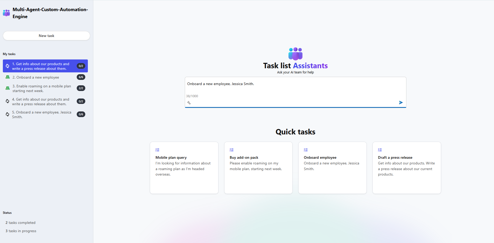

# Sample Questions

To help you get started, here are some **Sample Prompts** you can ask in the app:

1. Run each of the following sample prompts and verify that a plan is generated:
   - Launch a new marketing campaign
   - Procure new office equipment
   - Initiate a new product launch
     
2. Run the **Onboard employee** prompt:
   - Remove the employee name from the prompt to test how the solution handles missing information.
   - The solution should ask for the missing detail before proceeding.

3. Try running known **RAI test prompts** to confirm safeguard behavior:
   - You should see a toast message indicating that a plan could not be generated due to policy restrictions.

**Home Page**

**Task Page**
  

_This structured approach helps ensure the system handles prompts gracefully, verifies plan generation flows, and confirms RAI protections are working as intended._
